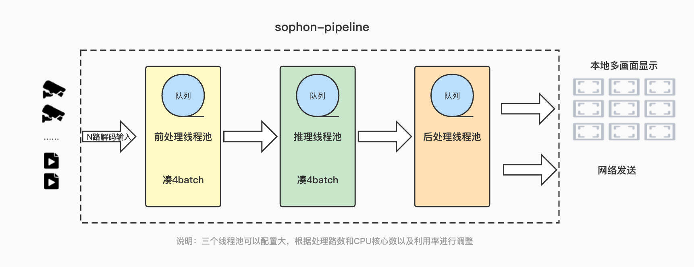

English | [简体中文](README.md)

# sophon-pipeline

# Note: New data download method.
Currently, the download method of models, test video streams and other data provided by sophon-pipeline has been changed from nas cloud disk to sftp. Please install the following dependencies to download data.
```
pip3 install dfss -i https://pypi.tuna.tsinghua.edu.cn/simple --upgrade
```

## 1 Introduction

Sophon Pipeline provides a simple high-performance acceleration framework based on Pipeline. Using this framework, pre-processing/reasoning/post-processing can be run on three threads respectively to maximize parallelism. Users only need to inherit a class and implement their own pre-processing / post-processing / can realize the whole process

<details open>
<summary><b>Sophon Pipeline features</b></summary>

- single-thread & single-model
- multithreading & single-model
- multithreading & multi-models
- multiple models in tandem
- pull streaming & push streaming
- visualization of the video structure

</details>

**Main catalog structure and module descriptions：**

| Catalogs               | modules                                         | Function Descriptions                                        |
| ---------------------- | ----------------------------------------------- | ------------------------------------------------------------ |
| [modules](./modules)   | [bmgui](./modules/bmgui)                        | Module used by Sophon Pipeline for GUI display of videos     |
|                        | [bmgui-lite](./modules/bmgui-lite)              | Since the SDK comes with no display function for OpenCV, this module provides bm::imshow to display the video as a supplement. |
|                        | [bmutility](./modules/bmutility)                | Provides basic libraries, strings, timers, etc.              |
|                        | [tracker](./modules/tracker)                    | Provides CPU-based tracking module                           |
| [examples](./examples) | [yolov5/v6/v7/v8](./examples/yolov5)            | A series object detection models of YOLO. Supports yolov5, yolov6, yolov7, yolov8 |
|                        | [ppyoloe](./examples/ppyoloe)                   | PP-YOLOE models. Supports PP-YOLOE, PP-YOLOE+                |
|                        | [video_stitch](./examples/video_stitch)         | 4 channel yolov5s object detection + stitch + encoding + RTSP Service |
|                        | [retinaface](./examples/retinaface)             | Retinaface face detection                                    |
|                        | [multi](./examples/multi)                       | Run two yolov5 object detection in parallel                  |
|                        | [face_recognition](./examples/face_recognition) | Tandem run face detection + face keypoints + face feature extraction |
|                        | [openpose](./examples/openpose)                 | OpenPose which is a real-time multi-person human pose detection model |
|                        | [face_detect](./examples/face_detect)           | Single stage headless face detector used Squeezenet as backbone |
|                        | [yolact](./examples/yolact)                     | YOLACT detection                                             |

**The main structural design of Sophon Pipeline：** 




<details>
<summary><b> Update Notes</b></summary>


|  Versions  | **instruction**                                              |
| :--------: | ------------------------------------------------------------ |
| **v0.3.7** | Add yolact demo program for 1684x(x86 PCIe, SoC, arm PCIe), 1684(x86 PCIe, SoC, arm PCIe). Add yolov5_opt and yolov7_opt models |
| **v0.3.5** | Add ppyoloe demo program for 1684x(x86 PCIe, SoC, arm PCIe), 1684(x86 PCIe, SoC, arm PCIe) |
| **v0.3.4** | Add yolov6, yolov7, yolov8 demo program for 1684x(x86 PCIe, SoC), 1684(x86 PCIe, SoC). Add FP16 model for 1684x for all demos. Add Kylins V10 for arm PCIe mode(1684, 1684x). |
| **v0.3.1** | Add openpose, face_detect demo program for 1684x(x86 PCIe, SoC), 1684(x86 PCIe, SoC) |
| **v0.3.0** | Add multi, face_recognition demo program for 1684x(x86 PCIe, SoC), 1684(x86 PCIe, SoC) |
| **v0.2.0** | Add retinaface demo program for 1684x(x86 PCIe, SoC)，1684(x86 PCIe, SoC) |
| **v0.1.2** | Add yolov5、video_stitch demo program for 1684x(x86 PCIe, SoC), 1684(x86 PCIe, SoC) |

</details>

## 2  Compilation process

### 2.1 Environmental preparation

If you install a PCIe AI accelerator card on the x86 platform, the development environment and the running environment can be unified, and you can directly build the development and running environments on the host machine. You need to install `libsophon`, `sophone-opencv` and `sophone-ffmpeg`.Refer to 《LIBSOPHON Manual》 for installing `libsophon`, the installation of `sophon-opencv` and `sophon-ffmpeg` can be found in《MULTIMEDIA User Manual》. Access [ Sophgo offical site](https://developer.sophon.ai/site/index/material/31/all.html) to download sophonSDK and documents.

### 2.2 Dependency installation

<details open>
<summary><b>sophon-pipeline's main dependency</b></summary>

- libsophon
- sophon-ffmpeg
- sophon-opencv

</details>

<details>
<summary><b>Version Dependencies</b></summary>

| sophon-pipeline's version | libsophon version of dependency | sophon-ffmpeg version of dependency | sophon-opencv version of dependency |
| :-----------------------: | :-----------------------------: | :---------------------------------: | :---------------------------------: |
|        **v0.3.7**         |             >=0.4.7             |               >=0.6.2               |               >=0.6.2               |
|        **v0.3.5**         |             >=0.4.6             |               >=0.6.0               |               >=0.6.0               |
|        **v0.3.4**         |             >=0.4.4             |               >=0.5.1               |               >=0.5.1               |
|        **v0.3.1**         |             >=0.4.4             |               >=0.5.1               |               >=0.5.1               |
|        **v0.3.0**         |             >=0.4.3             |               >=0.5.0               |               >=0.5.0               |
|        **v0.2.0**         |             >=0.4.2             |               >=0.4.0               |               >=0.4.0               |
|        **v0.1.2**         |             >=0.4.1             |               >=0.3.1               |               >=0.3.1               |

</details>


#### 2.2.1 x86 PCIe platform 

> Install QT dependencies on Ubuntu : 
````bash
sudo apt install -y qtbase5-dev
````

> Tracker function needs to install Eigen library:
```bash
sudo apt-get install -y libeigen3-dev
```

> Other dependencies :

```bash
sudo apt-get install -y libgflags-dev libgoogle-glog-dev libexiv2-dev
```

#### 2.2.2 arm SoC platform

For the SoC platform, the corresponding `libsophon`, `sophon-opencv` and `sophon-ffmpeg` runtime library packages have been integrated internally, located under `/opt/sophon/`, and can be directly used in the runtime environment.

 Usually, the program is cross-compiled on the x86 host computer so that it can run on the SoC platform. You need to create a cross-compilation environment on the x86 host using SOPHON SDK and package the header and library files that the program depends on into the soc-sdk directory.

**Preparation steps for cross-compiling environments and associated dependency environments： **[arm_soc.md](./docs/docs_en/arm_soc_en.md)

> If you encounter other cross-compilation problems, please refer to the **4.2.2 x86 cross-compiling programs ** section of 《LIBSOPHON Manual》

### 2.3 Compile instructions

#### 2.3.1 Compilation for each platform

```` bash
# Compile programs running on X86 platforms：
./tools/compile.sh x86 
# To compile a program running on the SoC platform, you need to prepare the relevant dependencies according to section 2.2.2, and then run the following command to compile it：
./tools/compile.sh soc ${soc-sdk} 
# compile programs running on the arm PCIe platforms:
./tools/compile.sh arm64
````

After compilation, the demo program will be stored in `${SOPHON_PIPELINE}/release/${APP}/${PLATFORM}` folder.

## 3 Running methods

- [yolov5/v6/v7/v8](./docs/docs_en/yolov5_en.md)
- [ppyoloe](./docs/docs_en/ppyoloe_en.md)
- [video_stitch](./docs/docs_en/video_stitch_en.md)
- [retinaface](./docs/docs_en/retinaface_en.md)
- [multi](./docs/docs_en/multi_en.md)
- [face_recognition](./docs/docs_en/face_recognition_en.md)
- [openpose](./docs/docs_en/openpose_en.md)
- [face_detect](./docs/docs_en/face_detect_en.md)
- [yolact](./docs/docs_en/yolact_en.md)

## 4 Model Performance

<details>
<summary><b> Model performance on SE7</b></summary>


|            Model             | int8 inference(ms) | int8(FPS) | fp16 inference(ms) | fp16(FPS) |
| :--------------------------: | :----------------: | :-------: | :----------------: | :-------: |
|         **yolov5s**          |        3.29        |    182    |        6.27        |    129    |
|       **yolov5_opt🚀**        |        2.37        |    260    |        6.13        |    137    |
|         **yolov6s**          |        3.03        |    108    |        4.42        |    105    |
|          **yolov7**          |        8.93        |    98     |        22.5        |    40     |
|       **yolov7_opt🚀**        |        7.14        |    119    |       19.63        |    48     |
|         **yolov8s**          |        3.69        |    157    |        7.00        |    130    |
|        **ppyoloe_s**         |        5.39        |    167    |        8.46        |    115    |
|      **ppyoloe_plus_s**      |        5.10        |    160    |        7.86        |    115    |
|     **openpose_coco_18**     |        5.38        |    40     |       11.26        |    37     |
|     **openpose_body_25**     |        3.43        |    29     |        7.00        |    28     |
|       **yolact_base**        |       13.86        |    63     |         -          |     -     |
|     **yolact_darknet53**     |       12.96        |    68     |         -          |     -     |
|     **yolact_resnet50**      |       12.27        |    70     |         -          |     -     |
| **retinaface_mobilenet0.25** |        0.67        |   ≥500    |        0.81        |   ≥500    |
|       **face_detect**        |        1.16        |   ≥500    |        1.45        |   ≥500    |
|     **face_recognition**     |         -          |     -     |         -          |     -     |
|          **multi**           |         -          |     -     |         -          |     -     |
|       **video_stitch**       |         -          |     -     |         -          |     -     |

**Clarification：**

- Test environment: SE7, 8-Core CPU @2.3GHz, TPU @1000MHz, VPU @800MHz, JPU @800MHz. SDK version: V23.03.01. Input videos and configurations are under the default configurations of each example.
- The speed of inference  do not contains the time cost of data reading and post-processing(NMS), which is cost time of  average an input sample.
- FPS is the maximum FPS value that each example can run on SE7.

</details>

<details>
<summary><b>Model performance on SE5</b></summary>


|            Model             | int8 inference(ms) | int8(FPS) |
| :--------------------------: | :----------------: | :-------: |
|         **yolov5s**          |        6.21        |    131    |
|         **yolov6s**          |        8.01        |    90     |
|          **yolov7**          |       17.64        |    33     |
|         **yolov8s**          |        7.49        |    118    |
|        **ppyoloe_s**         |       20.49        |    46     |
|      **ppyoloe_plus_s**      |       19.62        |    49     |
|     **openpose_coco_18**     |        9.65        |    39     |
|     **openpose_body_25**     |        6.20        |    27     |
|       **yolact_base**        |       32.75        |    29     |
|     **yolact_darknet53**     |       30.15        |    31     |
|     **yolact_resnet50**      |       28.72        |    33     |
| **retinaface_mobilenet0.25** |        1.77        |   ≥475    |
|       **face_detect**        |        1.42        |   ≥475    |
|     **face_recognition**     |         -          |     -     |
|          **multi**           |         -          |     -     |
|       **video_stitch**       |         -          |     -     |

**Clarification：**

- Test environment: SE5, 8-Core CPU @2.3GHz, TPU @550MHz, VPU @640MHz, JPU @160MHz. SDK version: V23.03.01. Input videos and configurations are under the default configurations of each example.
- The speed of inference  do not contains the time cost of data reading and post-processing(NMS), which is cost time of  average an input sample.
- FPS is the maximum FPS value that each example can run on SE5.

</details>


## 5 FAQ

Reference to [sophon-pipeline-FAQ](./docs/docs_en/FAQ_en.md)
