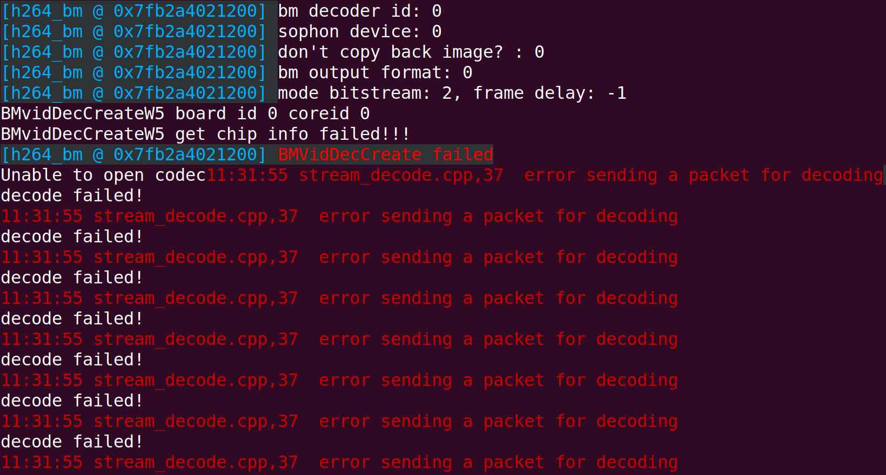
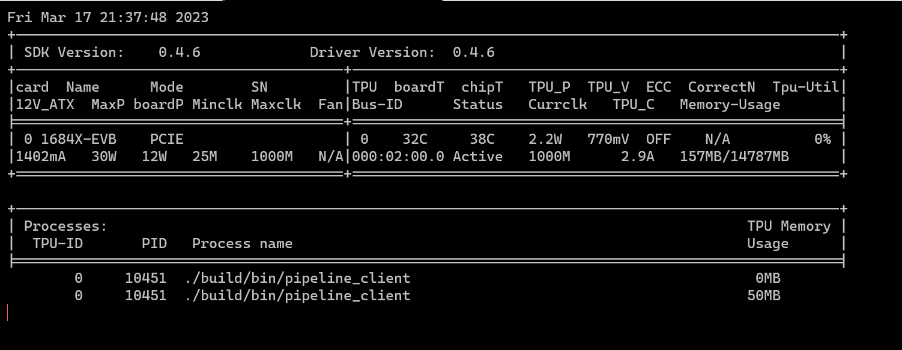

# FAQ

Frequently Asked Questions and Answers for sophon-pipeline

## 1 Frequently Asked Questions

**Q**: When running multiple inference streams, you may encounter memory allocation errors such as "bm_malloc_device_byte_heap error" or "bm::BMImage::create_batch Assertion BM_SUCCESS==ret failed".

**A**: 

This type of error is mainly caused by the failure of device memory allocation. There are two reasons for the failure:

(1) Insufficient device memory. You can confirm this by using the following command in SOC mode:

```bash
cat /sys/kernel/debug/ion/bm_vpp_heap_dump/summary
```

In PCIe mode, you can use the bm-smi tool to view the device memory space.

Solution:

If there is insufficient device memory, you need to optimize the program to reduce the usage of device memory or increase the corresponding device memory by modifying the memory layout in the dts file. For details, please refer to the relevant instructions in the official " BSP-software-doc ". Note: To obtain the " BSP-software-doc ", please visit our official website: [technical center (sophon.ai)](https://developer.sophon.ai/site/index/material/31/all.html)

(2) If the number of handles exceeds the system limit, it may be due to handle leaks or the system handle limit being set too low. You can confirm this by using the following method:

After the error occurs, use the following command to check:

```bash
dmesg > err.log
```

Search for keywords such as "error_code=-24" and "Too many open files" in the err.log file. This is because we use ION to manage memory, and ION depends on dma_buf, which assigns a file descriptor (fd) to each buffer it allocates for management. The system has a limit on the total number of open fd that can be active at the same time.

In this case, please check the maximum number of handles defined by the system：

```bash
ulimit -n
```

Check if the maximum number of handles is 20480. If not, please check the `/etc/security/limits.conf` file for the following two lines:

```bash
* soft nofile 20480
* hard nofile 20480 
```

Solution:

After ruling out memory leaks or handle leaks in the code itself, you can use the following two methods to increase the maximum number of handles in the system to solve the handle limitation problem:

(a) Use the `ulimit` command to temporarily modify the limit, which will become invalid after the terminal or server is restarted.

```bash
ulimit -HSn 20480
```

(b)Add the following lines to the end of the `/etc/security/limits.conf` file:

```
* soft nofile 20480
* hard nofile 20480
```

After adding the lines, restart the server to apply the changes.

> Note: If the above methods do not solve the problem, first use the `ps` command to obtain the process ID of the business process, and then use `cat /proc/$pid/limits` to check if the value of the "Max open files" line is 20480. If it is not, add "ulimit -n 20480" to the beginning of the shell script that directly starts the business program (such as the run.sh in the log example above). Rerun the business program and verify whether the modification was successful using `cat /proc/$pid/limits`. If all of the above methods have been checked and there are no problems, it may be that you have indeed applied for too many buffers. You can continue to increase the "max open files" using the above methods. However, the maximum should not exceed the number displayed by `cat /proc/sys/fs/file-max`.


**Q: Getting an error in Terminal when use pipeline_client: BMvidDecCreateW get chip info failed!!! error sending a packet for decoding. decode failed!**



**A:**

After installing SophonSDK, library dependencies of ffmpeg will link to sophon-mw-ffmpeg. You will see some of libraries link to  `/opt/sophon/sophon-ffmpeg-latest/lib/*` when use `ldd /usr/bin/ffmpeg`.

Solution:

The better way to link to the public version of ffmpeg using this command:

```bash
export LD_LIBRARY_PATH=/lib/x86_64-linux-gnu:$PATH
```

Then library dependencies of ffmpeg will be linked to `/lib/x86_64-linux-gnu/*` when use `ldd /usr/bin/ffmpeg`.

Similarly, if pipeline_clinet occupies TPU, you can solve it in the same way.

