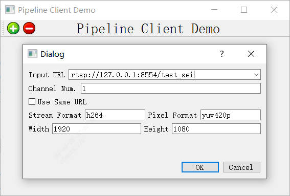

# pipeline_client_visualization

## Introduction

A companion client to sophon-pipeline that displays live streams and detection results.



## Download and install

- windows: Provide compiled files, `pipeline_client-winx64.zip`, download by:
```bash
python3 -m dfss --url=open@sophgo.com:sophon-pipeline/pipeline_client-winx64.zip
```
- ubuntu: Please compile your own, https://github.com/sophon-ai-algo/pipeline_client

## Conditions of use

- The client (the device on which the pipeline_client is running) and the server (the device on which the sophon-pipeline routine is running) must be network-connected, and network connectivity can be tested as follows.
  1. The port number is configured as an unoccupied port (which can be viewed using commands such as netstat).
  2. Enter ping {ip} to test the connectivity of the network.
  3. Enter telnet {ip} {port}，to test the connectivity of the network；
- Run the routines visualized by the available pipeline_client (video_stitch, multi do not use pipeline_client)

## Description of parameters

To use pipeline_client, the parameters of the video stream need to be configured correctly. These parameters are described below.

| parameter       | Instruction                                                  |
| --------------- | ------------------------------------------------------------ |
| `input url`     | Pull stream address, support `tcp`、`rtsp`                   |
| `Channel Num`   | Number of pull stream，The default is 1                      |
| `Use Same URL`  | Whether `pipeline_client` uses the filled `input url` for parsing. The default is not to use it. **NOT RECOMMENDED** to use this option, if you need to use this option, you need to know the internal `pipeline_client` and `tcp` and `rtsp` parsing rules. |
| `Stream Format` | Format of pull stream, default is h264.                      |
| `Pixel Format`  | Pixel format of the pull stream, default is `yuv420p`        |
| `Width`         | The width of the pull stream, default is `1920`              |
| `Height`        | The height of the pull stream, default is `1080`             |

## operation

**Assuming that the ip of the device where pipeline_client is running is 123.45.67.89 and port 9527 is available**

### TCP

1. You must start pipeline_client first, fill in the local ip and port: tcp://123.45.67.89:9527
2. Server-side configuration `.json` with `output_path` parameter as tcp://123.45.67.89:9527, run the sophon-pipeline routine
3. Wait, pipeline_client will display the image

### RTSP

If you use rtsp, you have to use it with an rtsp server. First push the stream to the rtsp server, then pipeline_client will pull the stream.

Recommended for rtsp server：

Open Source Repository：https://github.com/bluenviron/mediamtx

Or download the released executable file directly：https://github.com/bluenviron/mediamtx/releases

> **NOTE ：The device networks running the rtsp-simple-server, pipeline_client and sophone-pipeline routines need to be connected to each other. It is recommended that rtsp-simple-server and pipeline_client run on the same device.**

**The specific steps are as follows:** (**assuming that the device ip running rtsp-simple-server and pipeline_client is 123.45.67.89**)

1. Start rtsp server: `. /mediamtx`, **default port** is `8554`, if you need to modify the port, please modify it by yourself from `.yml` file, please make sure the port is not occupied before starting.
2. Run the sophon-pipeline routine and push the stream to the specified rtsp address: the `output_path` parameter of `.json` is configured as `rtsp://123.45.67.89:8554/abc`
3. Run pipeline_client, with the pull stream address specified as`rtsp://123.45.67.89:8554/abc`
4. Wait a moment, pipeline_client is visible

> Note: Since pipeline_client will force Channel Num information to be displayed at the end of the address when parsing rtsp addresses, if N videos are displayed, the address of the above example will be parsed as N addresses：rtsp://123.45.67.89:8554/abc_{X}, where {X} is a natural number from 0 to N-1. If 1-way video is displayed, the above instance address will be resolved to rtsp://123.45.67.89:8554/abc_0. If the address is configured as rtsp://123.45.67.89:8554, then pipeline_client will resolve to rtsp://123.45.67.89:8554_0 , pipeline_client will not be able to pull the stream.**So the output must be configured as rtsp://{ip}:{port}/{string}, not just rtsp://{ip}:{port}.**

